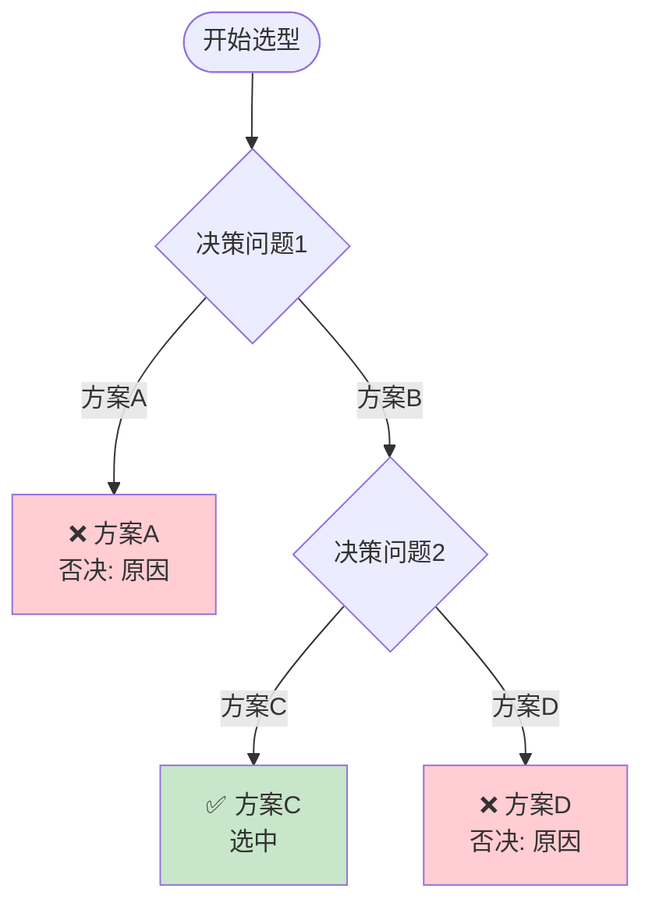

# My Decision Tree Doc Builder

从方案选型对话中提取决策节点，构建可视化的 Mermaid 决策树文档。

## 使用场景

- 方案选型讨论后的决策记录
- 技术架构决策的文档化
- 基础设施选型的决策追踪
- 团队决策对齐与回溯

## 调用方式

```
/my-decision-tree-doc-record [可选：决策主题]
```

### 版本管理模式

- `/my-decision-tree-doc-record --versions` — 列出所有版本
- `/my-decision-tree-doc-record --changelog` — 查看变更日志
- `/my-decision-tree-doc-record --diff v1.0.0 v1.2.0` — 对比两个版本
- `/my-decision-tree-doc-record --restore v1.0.0` — 回滚到指定版本
- `/my-decision-tree-doc-record --set-doc-dir <path>` — 设置默认输出目录

---

## 执行流程

### Phase 0：收集上下文元数据

运行以下命令收集项目信息：

```bash
bash SCRIPTS/collect_metadata.sh
```

> 脚本内容见 [SCRIPTS/collect_metadata.sh](./SCRIPTS/collect_metadata.sh)

从会话 system-reminder 中提取：
- **会话 ID**：从 session summary 或文件路径提取 UUID 部分
- **AI 模型**：从 system-reminder 中的模型信息读取

#### 会话耗时估算

1. **起止时间**：从会话开始到当前时刻
2. **空闲扣除规则**：如果用户两条消息之间的间隔**超过 2 小时**，则将该段等待时间扣除
3. **精度**：保留 1 位小数，单位为小时

```
> **预计耗时：** X.X 小时（HH:MM ~ HH:MM，空闲说明）
```

---

### Phase 1：获取统一文档项目路径

**全局记忆机制（跨项目生效）：**

```bash
# 尝试从全局 memory 读取
cat ~/.claude/memory/user_doc_dir.md 2>/dev/null || echo "暂无"
```

- 首次执行时询问用户统一文档项目路径
- 保存到全局 memory：`~/.claude/memory/user_doc_dir.md`
- 后续在**任何项目**中执行技能时，直接读取使用
- 用户可通过 `--set-doc-dir <path>` 重新设置

---

### Phase 2：检测同名文档

生成文档前，检查目标目录是否已存在同名文档：

```bash
# 检测同名文档（精确匹配：今天日期 + 决策主题）
TODAY=$(date +%Y-%m-%d)
ls doc/decision-trees/ | grep "^${TODAY}-{决策主题}.*\.md$"
```

**处理策略（三选一）：**

| 选项 | 说明 | 适用场景 |
|------|------|---------|
| **新建版本** | 在文件名末尾追加 `-v2`、`-v3` 等 | 内容差异较大，保留独立快照 |
| **增量追加** | 追加到最新版本末尾 | 同一主题的持续演进 |
| **覆盖文档** | 直接覆盖原文件 | 用户明确确认 |

若检测到同名文档，**必须询问用户**选择处理方式。

---

### Phase 3：识别决策节点

从会话中识别所有决策节点，包括：
- 明确的选择题（"方案 A vs 方案 B"）
- 包含约束条件的讨论
- 用户做出的最终选择
- AI 给出的否决理由

**识别关键词**：
- "方案选型对比"、"优缺点"
- "选择"、"决策"、"最终采用"
- "约束"、"限制"、"不能"
- "否决"、"排除"、"不行"

---

### Phase 4：提取决策数据

为每个决策节点提取：

| 字段 | 说明 | 示例 |
|------|------|------|
| `question` | 决策问题 | "核心目标是什么？" |
| `constraints` | 约束条件列表 | ["规模：少量", "目标：商业化"] |
| `options` | 可选方案及属性 | 见下方结构 |
| `selected` | 最终选择 | "控制系统" |
| `rationale` | 决策理由 | "便于持续优化和审计跟踪" |

**option 结构**：
```yaml
options:
  - id: "A"
    label: "方案A名称"
    pros: ["优势1", "优势2"]
    cons: ["劣势1"]
    selected: false
    eliminated: true
    elimination_reason: "不满足XX约束"
  - id: "B"
    label: "方案B名称"
    pros: ["优势1"]
    cons: ["劣势1"]
    selected: true
    elimination_reason: null
```

---

### Phase 5：生成 Mermaid 决策树

### 5.1 决策树格式



### 5.2 节点样式规范

| 节点类型 | Mermaid style | 颜色代码 |
|---------|---------------|---------|
| 开始 | `["开始"]` | 无 |
| 决策节点 | `{"问题"}` | 无 |
| 最终方案 | `["✅ 名称"]` | `fill:#c8e6c9` 绿色 |
| 否决方案 | `["❌ 名称"]` | `fill:#ffcdd2` 红色 |
| 待定/备选 | `["方案名称"]` | `fill:#fff9c4` 黄色 |

### 5.3 节点 ID 命名

- 开始节点：`START`
- 决策节点：`Q1`, `Q2`, `Q3`...
- 方案节点：`方案A_END`, `方案B_END`, `FINAL`
- 每个节点用 `-->` 或 `-.->` 连接

---

### Phase 6：生成决策记录表

```markdown
| 决策节点 | 选项 A | 选项 B | 最终选择 | 核心理由 |
|---------|--------|--------|---------|---------|
| Q1: 核心目标 | 模板系统 | 控制系统 | 控制系统 | 便于持续优化和审计 |
| Q2: VM 创建 | 纯手动 | Packer | Packer | Workstation API 限制 |
```

---

### Phase 7：生成约束条件追踪表

```markdown
## 约束条件追踪

| 约束来源 | 约束内容 | 影响决策 | 备注 |
|---------|---------|---------|------|
| VMware 环境 | Workstation Pro 无 REST API | Q2: 排除 Terraform | 改为 Packer |
| 商业化目标 | 需要可审计 | Q1: 排除模板系统 | 控制系统更适合 |
```

---

### Phase 8：输出文档（双目录机制）

#### 文档存放策略（双目录机制）

**1. 原始 Markdown** → 用户统一文档项目 `doc/decision-trees/`

**2. 跳转 HTML** → 当前项目 `doc/decision-trees/`

**文件命名**：
```
doc/decision-trees/{YYYY-MM-DD}-{决策主题}-decision-tree.md
```

若检测到同名文档，根据用户选择的策略处理：
- 新建版本：追加 `-v2`、`-v3` 等后缀
- 覆盖文档：直接覆盖

**跳转 HTML 模板：**

```html
<!DOCTYPE html>
<html lang="zh-CN">
<head>
    <meta charset="UTF-8">
    <meta http-equiv="refresh" content="0; url={链接地址}">
    <title>{决策主题}决策树 - 跳转中</title>
</head>
<body>
    <p>正在跳转到决策树文档...</p>
    <p>如果没有自动跳转，请点击：<a href="{链接地址}">{决策主题}决策树</a></p>
    <hr>
    <p><small>原始文档：{统一文档项目路径}/doc/decision-trees/{文件名}.md</small></p>
    <p><small>生成时间：{YYYY-MM-DD}</small></p>
</body>
</html>
```

**GitHub 链接必须 URL 编码：**

```bash
python3 -c "import urllib.parse; print(urllib.parse.quote('文件名.md'))"
```

---

### Phase 9：质量自检

#### 第一步：运行 Mermaid 语法检查

```bash
python3 SCRIPTS/validate_mermaid.sh <文件路径>
```

> 脚本内容见 [SCRIPTS/validate_mermaid.sh](./SCRIPTS/validate_mermaid.sh)

#### 第二步：逐项确认

- [ ] 决策树节点数量与识别到的决策节点一致
- [ ] 否决方案标注了 elimination_reason
- [ ] 最终方案标注了 selected
- [ ] Mermaid 语法验证通过（exit 0）
- [ ] 决策记录表包含所有决策节点
- [ ] 约束条件追踪表完整
- [ ] 无乱码（运行 `grep -n "�" <文件路径>` 确认）
- [ ] 文档头部字段完整：决策主题、日期、预计耗时

---

### Phase 10：自动提交到 GitHub

**⚠️ 安全约束：**
- 仅提交 `doc/decision-trees/` 目录
- 绝不使用 `git add .` 或 `git add -A`

```bash
bash SCRIPTS/auto_commit.sh <统一文档项目路径> <文档标题> <决策节点数> <最终方案>
```

**Git 提交格式**：
```
docs: 新增 {决策主题} 决策树文档

- 决策节点数: N 个
- 最终方案: {方案名称}
- 关键约束: {约束1}, {约束2}
```

---

### Phase 11：自学习更新机制

#### 11.1 改进发现时机

在执行过程中关注：
- 新场景未覆盖
- 重复手动操作
- 用户反馈修正
- 异常降级
- 缺失能力

#### 11.2 建议提出格式

```
🧠 技能自学习建议（本次执行中发现）

发现 N 个可改进之处：

┌─ 建议 1：{标题}
│  类型：新增能力 / 优化流程 / 修复问题
│  触发原因：{具体发生了什么}
│  改进方案：{怎么改}
│  影响范围：{影响哪些 Phase}
└─ 优先级：高 / 中 / 低

是否应用这些改进？
```

#### 11.3 用户决策

| 选项 | 说明 |
|------|------|
| **全部应用** | 批量修改 |
| **逐条选择** | 逐个确认 |
| **暂不改动** | 记录到 IMPROVEMENTS.md |
| **自定义** | 用户补充 |

#### 11.4 应用流程

```
1. 备份当前版本
2. 修改 SKILL.md
3. 升版号（patch/minor）
4. 备份新版本
5. 展示 diff
```

#### 11.5 建议记录

若用户选择「暂不改动」，记录到：

```markdown
# 技能改进建议池

## 待处理建议

### [{日期}] {标题}
- **类型：** 新增能力
- **触发场景：** {描述}
- **建议方案：** {描述}
- **状态：** 待处理 / 已应用(v{版本号}) / 已驳回({原因})
```

---

## 版本管理

### 版本元数据

```bash
# 查看当前版本
cat versions/VERSIONS.json

# 查看变更日志
cat versions/CHANGELOG.md
```

### 版本对比

```bash
# 对比任意两个版本
diff versions/SKILL-v1.0.0.md versions/SKILL-v1.2.0.md
```

### 版本回滚

```bash
# 回滚到指定版本
cp versions/SKILL-v${TARGET_VERSION}.md SKILL.md
```

---

## 输出文档模板

> 完整模板内容见 [TEMPLATE.md](./TEMPLATE.md)

生成文档时，读取 TEMPLATE.md 并根据会话内容填充各占位符。

---

## 输出示例

```
✅ 决策树文档已生成：
  📄 原始文档：/root/sh/doc/decision-trees/2026-05-12-VMware自动化方案决策树.md
  🔗 跳转页面：doc/decision-trees/2026-05-12-VMware自动化方案决策树.html
  🌐 GitHub 链接：https://github.com/chujun/aiubuntu1-sh/blob/main/doc/decision-trees/2026-05-12-VMware%E8%87%AA%E5%8A%A8%E5%8C%96%E6%96%B9%E6%A1%88%E5%86%B3%E7%AD%96%E6%A0%91.md

📊 文档统计：
  - 总行数：XXX 行
  - Mermaid 图表：X 张
  - 决策节点数：N 个

🚀 Git 提交状态：
  - ✅ 已提交并推送到 GitHub (commit: abc1234)
```
