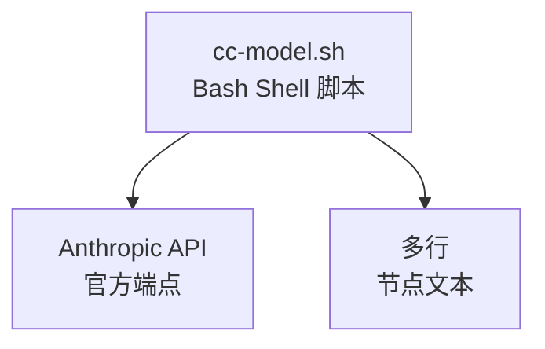

# Mermaid 图表语法规范

> 本文件由 SKILL.md Phase 4/5 引用，定义 Mermaid 图表的语法规范和验证规则。
> 生成文档时**必须严格遵守**这些规则。

## 错误写法（会导致 Syntax Error）

```markdown
```mermaid
graph TD<br/>  A[node text] --> B[node<br/>text]
```
- ❌ `graph TD<br/>` — 换行符被替换到了语法关键字后面
- ❌ `A[node<br/>text]` — 括号内文本的多行用 `<br/>` 分隔是可以的，但语法行必须独立
```

## 正确写法（标准 Mermaid 语法）

```markdown


## 语法规则

1. **语法关键字独立一行**：`graph TD`、`flowchart TD`、`sequenceDiagram`、`pie`、`mindmap` 等必须单独占一行，后面不能紧跟节点定义
2. **节点定义每行一个**：每个节点/边定义单独一行，用缩进（4 空格）区分层级
3. **多行节点文本**：在 `[节点文本]` 或 `["节点文本"]` 内部使用 `<br/>` 实现换行
4. **子图 subgraph**：标签文字用双引号包裹，如 `subgraph "用户层"`
5. **pie 图表**：数据行每行一条，缩进 4 空格，格式 `"标签" : 数值`
6. **sequenceDiagram**：`participant 名称 as 别名`，消息用 `->>` `-->>` 等箭头符号
7. **mindmap**：层级用缩进表示，根节点用 `root(("文字"))`，子节点用 `文字`

## 禁止清单

- ❌ 在 `graph TD` 后面直接写节点（必须换行）
- ❌ 在 `sequenceDiagram`/`pie` 等关键字后直接跟内容（必须换行）
- ❌ 用 `\n` 而非 `<br/>` 做节点内换行
- ❌ 多行拼成一行不放 `<br/>`
- ❌ 在节点文本中用 `\"` 或 `\'` 作为转义（Mermaid 节点文本不支持 C 风格转义）
- ❌ 在单引号节点文本中含 `'`（如 `['text's error']`），用双引号代替
