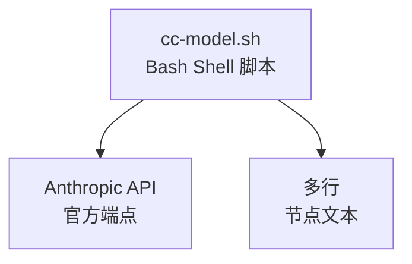

# My Explore Doc Record

将本次会话整理成面向 AI 学习者的实践探索文档，保存到项目的 `doc/ai-explore/` 目录。

## 背景与教学意图

本技能的文档格式设计有以下教学意图（Claude 生成文档时请把握这些方向）：

| 章节 | 教学意图 |
|------|---------|
| 用户价值 | 引导思考"AI 解决了什么真实问题"，而非只关注技术实现 |
| 工具统计 | 建立对 Claude Code 生态（Agent/Skill/MCP/Tool）的整体认知 |
| 难点与挑战 | 展示走弯路、初次判断错误、Agent 失败等真实过程，比成功结果更有学习价值 |
| 提示词清单 | 展示提示词迭代的真实过程，体现精确描述的价值 |
| 根因分析图 | 培养"数据流追踪 + 源码阅读"的 AI 辅助调试方法论 |
| 经验总结 | 提炼可复用的 AI 协作模式，而非一次性技巧 |

---

## 使用场景

- 会话结束前，想留存本次 AI 辅助开发过程
- 想沉淀 AI 调试方法论、工具使用经验
- 想生成供他人学习的 AI 协作案例文档

## 调用方式

```
/my-explore-doc-record [可选：主题关键词]
```

示例：
- `/my-explore-doc-record` — 自动推断主题
- `/my-explore-doc-record Bug修复` — 指定主题关键词

---

## 执行流程

### Phase 0：收集上下文元数据

运行以下命令收集项目信息，所有命令均做好错误降级处理：

```bash
# 1. 当前日期
date +%Y-%m-%d

# 2. 项目路径
pwd

# 3. GitHub 地址（非 git 项目优雅降级）
git remote get-url origin 2>/dev/null || echo "暂无"

# 4. 当前分支与最近提交
git branch --show-current 2>/dev/null || echo "非 git 项目"
git log --oneline -5 2>/dev/null || echo "暂无"

# 5. 技术栈自动检测（按优先级依次检测）
if [ -f package.json ]; then
  python3 -c "import json,sys; d=json.load(open('package.json')); deps=list({**d.get('dependencies',{}),**d.get('devDependencies',{})}.keys()); print('Node.js/TypeScript:', deps[:12])"
elif [ -f go.mod ]; then
  head -3 go.mod
elif [ -f pyproject.toml ] || [ -f requirements.txt ]; then
  echo "Python 项目"
elif [ -f Cargo.toml ]; then
  echo "Rust 项目"
elif [ -f pom.xml ] || [ -f build.gradle ]; then
  echo "Java/Kotlin 项目"
else
  echo "技术栈未知，请手动填写"
fi

# 6. 动态读取已配置的 MCP 服务
python3 -c "
import json, os
cfg = os.path.expanduser('~/.claude/settings.json')
try:
    d = json.load(open(cfg))
    mcps = d.get('mcpServers', {})
    if mcps:
        for name, conf in mcps.items():
            print(f'  - {name}')
    else:
        print('  （未配置 MCP 服务）')
except:
    print('  （无法读取配置）')
" 2>/dev/null
```

从会话 system-reminder 中提取：
- **会话 ID**：读取 system-reminder 中的文件路径，提取 UUID 部分
- **AI 模型**：读取 system-reminder 中的模型信息（如 `claude-sonnet-4-6`）

---

### Phase 1：统计工具使用情况

回顾本次会话，逐项统计：

#### 1.1 AI 大模型

| 模型 ID | 名称 | 用途 | 调用范围 |
|---------|------|------|---------|
| （从 system-reminder 读取） | — | 主对话 | 全程 |

#### 1.2 Claude Code 内置工具调用（估算）

统计 Bash / Read / Edit / Write / Grep / Glob / Agent / Skill 各自调用次数，用于生成 pie chart。

> ⚠️ 以下数据为基于会话记忆的估算值，非精确统计。

#### 1.3 Agent（智能代理）

记录本次会话中 Claude 主动调用的每一个 Agent，**失败情况也必须记录**：

| Agent 名称 | 触发方式 | 执行结果 | 失败原因（如有） |
|-----------|---------|---------|----------------|
| （如 code-reviewer） | Claude 后台调用 | ✅成功 / ❌失败 | 如：速率限制 |

#### 1.4 技能（Skill）

记录用户和 Claude 调用的每一个 Skill，包含 `/skill` 形式的命令调用：

| 技能名称 | 触发命令 | 触发方 | 调用次数 | 是否完整执行 |
|---------|---------|-------|---------|------------|
| （如 prompt-optimizer） | /xxx | 用户 | N 次 | ✅完整 / ⚠️中断 |

#### 1.5 MCP 服务

从 Phase 0 动态读取的 MCP 列表为准，逐项标记本次是否实际调用：

| MCP 服务 | 工具前缀 | 本次调用次数 | 说明 |
|---------|---------|------------|------|
| （动态填充） | — | 0 / N | 未调用原因或调用场景 |

#### 1.6 浏览器插件（用户环境，可选）

如会话中提及浏览器插件干扰（如控制台报错），在此记录并说明是否与应用相关。

---

### Phase 2：整理提示词清单

从当前会话完整回溯用户的每一条输入，**原样保留，一字不改**，按时间顺序编号。

**提示词范围说明：**
- ✅ 包含：普通文字输入、带截图的输入、`/skill` 命令调用（标注 `[技能调用]`）
- ❌ 不包含：Claude 的回复、工具调用结果、system-reminder 内容

如果当前会话是从压缩摘要恢复的（存在 compaction），则：
- 上一会话的提示词标注「【上一会话（已归档到摘要）】」
- 当前会话提示词标注「【当前会话】」

> 注意：提示词部分禁止修改、摘要、翻译或美化，必须原文呈现。

---

### Phase 3：推断文档主题与文件名

**主题推断规则（按优先级）：**

1. 若用户调用时提供了参数（如 `/my-explore-doc-record Bug修复`），使用该参数
2. 否则，分析会话主要内容自动推断：
   - 新功能开发 → `XX应用功能开发实践探索之旅`
   - Bug 调试修复 → `XX应用Bug修复实践探索之旅`
   - 架构重构 → `XX应用架构重构实践探索之旅`
   - 测试覆盖 → `XX应用测试覆盖实践探索之旅`
   - 综合 → `XX应用AI辅助开发实践探索之旅`

**文件名格式：**
```
doc/ai-explore/{YYYY-MM-DD}-{项目简称}{主题关键词}实践探索之旅.md
```

**同名文件处理策略：**
- 若目标文件已存在，在文件名末尾追加 `-v2`、`-v3` 等，不覆盖已有文档
- 生成完成后告知用户实际写入的文件名

---

### Phase 3.5：技能版本备份（自动执行）

每次执行技能时，自动备份当前 SKILL.md 到 `versions/` 目录，便于对比历史变动。

**备份规则：**

```bash
# 技能文件路径
SKILL_DIR="$(dirname "$(realpath "$0")" 2>/dev/null || echo "/data/claude/claude_root/skills/my-explore-doc-record")"
SKILL_FILE="${SKILL_DIR}/SKILL.md"
VERSION_DIR="${SKILL_DIR}/versions"

# 读取当前版本号
CURRENT_VERSION=$(grep '^version:' "$SKILL_FILE" | sed 's/version: *"\(.*\)"/\1/')

# 检查是否已有该版本的备份
if [ ! -f "${VERSION_DIR}/SKILL-v${CURRENT_VERSION}.md" ]; then
    mkdir -p "$VERSION_DIR"
    cp "$SKILL_FILE" "${VERSION_DIR}/SKILL-v${CURRENT_VERSION}.md"
    echo "✅ 已备份版本 v${CURRENT_VERSION}"
else
    echo "ℹ️ 版本 v${CURRENT_VERSION} 备份已存在，跳过"
fi
```

**版本目录结构：**
```
skills/my-explore-doc-record/
├── SKILL.md                    # 当前版本（始终最新）
└── versions/
    ├── SKILL-v1.3.1.md         # 历史版本备份
    ├── SKILL-v1.4.0.md         # 历史版本备份
    └── ...                     # 按版本号递增
```

**对比变动方法：**
```bash
# 对比任意两个版本的差异
diff versions/SKILL-v1.3.1.md versions/SKILL-v1.4.0.md

# 或使用 git diff 格式查看
diff -u versions/SKILL-v1.3.1.md versions/SKILL-v1.4.0.md
```

> 注意：版本备份仅在技能文件本身被修改（version 字段变化）时创建新备份，避免重复。

---

### Phase 4：生成文档

创建 `doc/ai-explore/` 目录（如不存在），写入完整 Markdown 文档。

#### ⚠️ Mermaid 图表语法规范（必须严格遵守）

**错误写法（会导致 Syntax Error）：**
```markdown
```mermaid
graph TD<br/>  A[node text] --> B[node<br/>text]
```
❌ `graph TD<br/>` — 换行符被替换到了语法关键字后面
❌ `A[node<br/>text]` — 括号内文本的多行用 `<br/>` 分隔是可以的，但语法行必须独立
```

**正确写法（标准 Mermaid 语法）：**
```markdown


**语法规则：**
1. **语法关键字独立一行**：`graph TD`、`flowchart TD`、`sequenceDiagram`、`pie`、`mindmap` 等必须单独占一行，后面不能紧跟节点定义
2. **节点定义每行一个**：每个节点/边定义单独一行，用缩进（4 空格）区分层级
3. **多行节点文本**：在 `[节点文本]` 或 `["节点文本"]` 内部使用 `<br/>` 实现换行
4. **子图 subgraph**：标签文字用双引号包裹，如 `subgraph "用户层"`
5. **pie 图表**：数据行每行一条，缩进 4 空格，格式 `"标签" : 数值`
6. **sequenceDiagram**：`participant 名称 as 别名`，消息用 `->>` `-->>` 等箭头符号
7. **mindmap**：层级用缩进表示，根节点用 `root(("文字"))`，子节点用 `文字`

**禁止：**
- ❌ 在 `graph TD` 后面直接写节点（必须换行）
- ❌ 在 `sequenceDiagram`/`pie` 等关键字后直接跟内容（必须换行）
- ❌ 用 `\n` 而非 `<br/>` 做节点内换行
- ❌ 多行拼成一行不放 `<br/>`
- ❌ 在节点文本中用 `\"` 或 `\'` 作为转义（Mermaid 节点文本不支持 C 风格转义）
- ❌ 在单引号节点文本中含 `'`（如 `['text's error']`），用双引号代替

#### 章节生成规则

- 第一章"AI 角色与工作概述"：**必须包含**，总结 AI 在会话中承担的角色（如开发者、调试专家、文档整理者等）和具体工作内容
- 第七章"测试结果"：**仅当会话中实际运行了测试时生成**；否则替换为"七、关键决策记录"，记录会话中的重要技术决策
- 第八章"难点与挑战"：**必须包含**，记录初次判断错误、工具失败、走弯路等真实过程
- 其余章节：固定包含

#### 文档结构模板

```markdown
# {项目名称} {主题} 实践探索之旅

> **主题：** {主题描述}
> **日期：** {YYYY-MM-DD}
> **受众：** AI 学习者 / Claude Code 使用者
> **会话 ID：** `{session_id}`
> **项目路径：** `{abs_path}`
> **GitHub 地址：** {url 或 暂无}

---

## 目录

- [一、AI 角色与工作概述](#一ai-角色与工作概述)
- [二、主要用户价值](#二主要用户价值)
- [三、开发环境](#三开发环境)
- [四、技术栈](#四技术栈)
- [五、AI 模型 / 插件 / Agent / 技能 / MCP 使用统计](#五ai-模型--插件--agent--技能--mcp-使用统计)
- [六、会话主要内容](#六会话主要内容)
- [七、测试结果 / 关键决策记录](#七测试结果--关键决策记录)
- [八、主要挑战与转折点](#八主要挑战与转折点)
- [九、用户提示词清单](#九用户提示词清单)
- [十、AI 辅助实践经验](#十ai-辅助实践经验)

---

## 一、AI 角色与工作概述

> 本章总结 AI 在本次会话中承担的角色定位及具体工作内容，帮助读者快速了解 AI 的协作方式。

### 角色定位

（从会话内容中提炼 AI 承担的所有角色，以表格形式列出。一次会话中 AI 可能同时承担多种角色。）

| 角色 | 说明 |
|------|------|
| （如：开发者） | （如：负责功能实现与代码编写） |
| （如：调试专家） | （如：定位并修复 Bug） |
| （如：文档整理者） | （如：编写和优化项目文档） |
| （如：UI 设计师） | （如：设计界面交互与样式） |
| （如：架构师） | （如：设计系统架构与技术选型） |
| （如：测试工程师） | （如：编写单元测试与集成测试） |

**常见角色参考（按需选用）：** 开发者、调试专家、架构师、UI 设计师、测试工程师、文档整理者、DevOps 工程师、数据分析师、API 集成工程师、代码审查者、重构工程师、性能优化师

### 具体工作

（以简洁的条目列出 AI 在会话中完成的具体工作，不需要过于细节，抓住核心即可。）

- （如：对接 MiniMax API，实现文生图功能）
- （如：编写 Python 脚本并进行单元自测）
- （如：排查 Mermaid 图表语法错误并批量修复）
- （如：优化技能文件结构，新增版本备份机制）

---

## 二、主要用户价值
（3-6 条，说明本次 AI 协作解决了什么真实问题，带来了什么价值）

---

## 三、开发环境
（OS / Shell / 包管理器 / Dev Server 端口 / 浏览器等）

---

## 四、技术栈
（Mermaid graph 展示层次结构 + 表格明细）

---

## 五、AI 模型 / 插件 / Agent / 技能 / MCP 使用统计

### 5.1 AI 大模型
### 5.2 开发工具
### 5.3 插件（Plugin）
### 5.4 Agent（智能代理）
（含执行流程 sequenceDiagram，包括失败情况）
### 5.5 技能（Skill）
（含技能执行流程 flowchart，标注中断情况）
### 5.6 MCP 服务
（基于动态读取结果，明确标注已调用 / 未调用 / 调用次数）
### 5.7 Claude Code 工具调用统计
（pie chart + 估算说明）
### 5.8 浏览器插件（用户环境，可选）

---

## 六、会话主要内容

### 6.1 任务全景
（flowchart 展示完整工作流，包含决策节点和最终状态）

### 6.2 核心问题 1（标题描述问题）
（根因分析 flowchart + 修复说明）

### 6.3 核心问题 2（如有）
（sequenceDiagram 展示时序/对比）

（根据实际问题数量增减子节）

---

## 七、测试结果（如有测试）/ 关键决策记录（无测试时）

**有测试时：**
（pie chart + 表格，含跳过原因说明）

**无测试时：**
| 决策点 | 选项 A | 选项 B | 最终选择 | 理由 |
|--------|--------|--------|---------|------|

---

## 八、主要挑战与转折点

（记录初次判断失误、工具失败、走弯路等真实过程，这是最有学习价值的部分）

| 挑战 | 初始判断 | 实际根因 | 转折点 |
|------|---------|---------|--------|

---

## 九、用户提示词清单（原文，一字未改）

### 【上一会话（已归档到摘要）】（如有）
**提示词 N：**
\`\`\`
（原文）
\`\`\`

### 【当前会话】
**提示词 N：**
\`\`\`
（原文）
\`\`\`

---

## 十、AI 辅助实践经验（面向 AI 学习者）
（mindmap 图 + 经验表格，每条经验包含"经验"和"核心教训"两列）

---

*文档生成时间：{YYYY-MM-DD} | 由 {模型名称} (`{模型ID}`) 辅助生成*
```

---

### Phase 5：质量自检 + Mermaid 语法自动验证

文档写完后执行以下两件事：

#### 第一步：运行自动 Mermaid 语法检查

生成文档后，**立即执行**以下命令验证所有 Mermaid 图表语法：

```bash
# 将 <文件路径> 替换为实际生成的文档路径
python3 -c "
import re, sys

fpath = sys.argv[1]
with open(fpath) as f:
    content = f.read()

blocks = re.findall(r'\`\`\`mermaid\n(.*?)\n\`\`\`', content, re.DOTALL)
if not blocks:
    print('未找到 Mermaid 图表')
    sys.exit(1)

errors = []
for idx, block in enumerate(blocks, 1):
    lines = block.strip().split('\n')
    first = lines[0]

    # 错误1: <br/> 在语法关键字行（关键字和节点写在同一行）
    if '<br/>' in first:
        errors.append(f'图表 #{idx}: <br/> 在关键字行: {first[:60]}')
        continue

    # 错误2: 关键字行和节点定义写在同一物理行内（无换行）
    if len(lines) == 1:
        errors.append(f'图表 #{idx}: 关键字行无后续内容')
        continue
    stripped = first.rstrip()
    if re.search(r'[A-Z]\[|[A-Z]\(|[A-Z]\{|\|[\-]>', stripped):
        errors.append(f'图表 #{idx}: 关键字与节点写在同一行: {stripped[:60]}')

    # 错误3: 节点文本中含有 C 风格转义（\' 或 \"），Mermaid 不支持
    for line in lines:
        if re.search(r'\[.*\\[\'"].*\]|\[.*[^\\]\'.*\]', line):
            errors.append(f'图表 #{idx}: 节点文本含转义字符: {line[:60]}')

print(f'检查了 {len(blocks)} 个 Mermaid 图表')
if errors:
    for e in errors:
        print(f'❌ {e}')
    sys.exit(1)
else:
    print('✅ 全部图表语法正确')
" <文件路径>
```

> ⚠️ **必须生成文档后立即运行此命令**，验证通过才继续提交。若有错误，修复对应图表后重新验证。

#### 第二步：逐项确认

- [ ] 第一章"AI 角色与工作概述"已填写：角色表格至少 1 行，具体工作至少 2 条
- [ ] 提示词清单：逐条比对，确认原文无修改，slash 命令已标注 `[技能调用]`
- [ ] 会话 ID 已填写（非占位符 `{session_id}`）
- [ ] GitHub 地址已填写（或明确写"暂无"）
- [ ] 项目路径为绝对路径
- [ ] MCP 列表来自动态读取，非硬编码
- [ ] Mermaid 图表至少 4 张，类型至少涵盖 `flowchart`、`sequenceDiagram`、`pie` 中的 2 种
- [ ] **上一步的自动验证命令已通过（exit 0）**
- [ ] Agent 失败 / Skill 中断情况已如实记录（不隐瞒）
- [ ] 第八章"主要挑战与转折点"已填写实质内容（不能为空或占位符）
- [ ] pie chart 下方有估算说明
- [ ] 文档末尾有生成时间和模型署名
- [ ] 若同名文件已存在，已追加版本号而非覆盖

---

## 输出示例

成功执行后输出：

```
✅ 文档已生成：doc/ai-explore/2026-04-09-中国花卉地图应用Bug修复实践探索之旅.md

📊 文档统计：
  - 总行数：XXX 行（wc -l 实际计算）
  - Mermaid 图表：X 张
  - 提示词条数：X 条
  - 章节数：9 章
```
