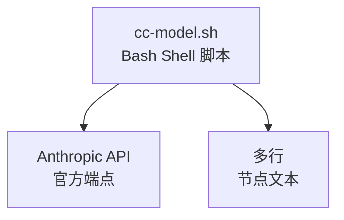

# My Explore Doc Record

将本次会话整理成面向 AI 学习者的实践探索文档。原始 Markdown 存放到用户统一文档项目的 `doc/ai-explore/` 目录，当前项目 `doc/ai-explore/` 放跳转 HTML 页面，并自动提交到 GitHub 远端。

## 背景与教学意图

本技能的文档格式设计有以下教学意图（Claude 生成文档时请把握这些方向）：

| 章节 | 教学意图 |
|------|---------|
| 用户价值 | 引导思考"AI 解决了什么真实问题"，而非只关注技术实现 |
| 工具统计 | 建立对 Claude Code 生态（Agent/Skill/MCP/Tool）的整体认知 |
| 难点与挑战 | 展示走弯路、初次判断错误、Agent 失败等真实过程，比成功结果更有学习价值 |
| 提示词清单 | 展示提示词迭代的真实过程，体现精确描述的价值 |
| 根因分析图 | 培养"数据流追踪 + 源码阅读"的 AI 辅助调试方法论 |
| 经验总结 | 提炼可复用的 AI 协作模式，而非一次性技巧 |

---

## 使用场景

- 会话结束前，想留存本次 AI 辅助开发过程
- 想沉淀 AI 调试方法论、工具使用经验
- 想生成供他人学习的 AI 协作案例文档

## 调用方式

```
/my-explore-doc-record [可选：主题关键词或版本管理命令]
```

### 文档生成模式

- `/my-explore-doc-record` — 自动推断主题
- `/my-explore-doc-record Bug修复` — 指定主题关键词

### 版本管理模式

- `/my-explore-doc-record --versions` — 列出所有版本
- `/my-explore-doc-record --changelog` — 查看变更日志
- `/my-explore-doc-record --diff v1.8.0 v1.9.0` — 对比两个版本
- `/my-explore-doc-record --info v1.9.0` — 查看指定版本详情
- `/my-explore-doc-record --restore v1.8.0` — 回滚到指定版本

---

## 执行流程

### Phase 0：收集上下文元数据

运行以下命令收集项目信息，所有命令均做好错误降级处理：

```bash
# 1. 当前日期
date +%Y-%m-%d

# 2. 项目路径
pwd

# 3. GitHub 地址（非 git 项目优雅降级）
git remote get-url origin 2>/dev/null || echo "暂无"

# 4. 当前分支与最近提交
git branch --show-current 2>/dev/null || echo "非 git 项目"
git log --oneline -5 2>/dev/null || echo "暂无"

# 5. 技术栈自动检测（按优先级依次检测）
if [ -f package.json ]; then
  python3 -c "import json,sys; d=json.load(open('package.json')); deps=list({**d.get('dependencies',{}),**d.get('devDependencies',{})}.keys()); print('Node.js/TypeScript:', deps[:12])"
elif [ -f go.mod ]; then
  head -3 go.mod
elif [ -f pyproject.toml ] || [ -f requirements.txt ]; then
  echo "Python 项目"
elif [ -f Cargo.toml ]; then
  echo "Rust 项目"
elif [ -f pom.xml ] || [ -f build.gradle ]; then
  echo "Java/Kotlin 项目"
else
  echo "技术栈未知，请手动填写"
fi

# 6. 动态读取已配置的 MCP 服务
python3 -c "
import json, os
cfg = os.path.expanduser('~/.claude/settings.json')
try:
    d = json.load(open(cfg))
    mcps = d.get('mcpServers', {})
    if mcps:
        for name, conf in mcps.items():
            print(f'  - {name}')
    else:
        print('  （未配置 MCP 服务）')
except:
    print('  （无法读取配置）')
" 2>/dev/null
```

从会话 system-reminder 中提取：
- **会话 ID**：读取 system-reminder 中的文件路径，提取 UUID 部分
- **AI 模型**：读取 system-reminder 中的模型信息（如 `claude-sonnet-4-6`）

---

### Phase 1：统计工具使用情况

回顾本次会话，逐项统计：

#### 1.1 AI 大模型

| 模型 ID | 名称 | 用途 | 调用范围 |
|---------|------|------|---------|
| （从 system-reminder 读取） | — | 主对话 | 全程 |

#### 1.2 Claude Code 内置工具调用（估算）

统计 Bash / Read / Edit / Write / Grep / Glob / Agent / Skill 各自调用次数，用于生成 pie chart。

> ⚠️ 以下数据为基于会话记忆的估算值，非精确统计。

#### 1.3 Agent（智能代理）

记录本次会话中 Claude 主动调用的每一个 Agent，**失败情况也必须记录**：

| Agent 名称 | 触发方式 | 执行结果 | 失败原因（如有） |
|-----------|---------|---------|----------------|
| （如 code-reviewer） | Claude 后台调用 | ✅成功 / ❌失败 | 如：速率限制 |

#### 1.4 技能（Skill）

记录用户和 Claude 调用的每一个 Skill，包含 `/skill` 形式的命令调用：

| 技能名称 | 触发命令 | 触发方 | 调用次数 | 是否完整执行 |
|---------|---------|-------|---------|------------|
| （如 prompt-optimizer） | /xxx | 用户 | N 次 | ✅完整 / ⚠️中断 |

#### 1.5 MCP 服务

从 Phase 0 动态读取的 MCP 列表为准，逐项标记本次是否实际调用：

| MCP 服务 | 工具前缀 | 本次调用次数 | 说明 |
|---------|---------|------------|------|
| （动态填充） | — | 0 / N | 未调用原因或调用场景 |

#### 1.6 浏览器插件（用户环境，可选）

如会话中提及浏览器插件干扰（如控制台报错），在此记录并说明是否与应用相关。

---

### Phase 2：整理提示词清单

从当前会话完整回溯用户的每一条输入，**原样保留，一字不改**，按时间顺序编号。

**提示词范围说明：**
- ✅ 包含：普通文字输入、带截图的输入、`/skill` 命令调用（标注 `[技能调用]`）
- ❌ 不包含：Claude 的回复、工具调用结果、system-reminder 内容

如果当前会话是从压缩摘要恢复的（存在 compaction），则：
- 上一会话的提示词标注「【上一会话（已归档到摘要）】」
- 当前会话提示词标注「【当前会话】」

> 注意：提示词部分禁止修改、摘要、翻译或美化，必须原文呈现。

---

### Phase 3：推断文档主题与文件名

**主题推断规则（按优先级）：**

1. 若用户调用时提供了参数（如 `/my-explore-doc-record Bug修复`），使用该参数
2. 否则，分析会话主要内容自动推断：
   - 新功能开发 → `XX应用功能开发实践探索之旅`
   - Bug 调试修复 → `XX应用Bug修复实践探索之旅`
   - 架构重构 → `XX应用架构重构实践探索之旅`
   - 测试覆盖 → `XX应用测试覆盖实践探索之旅`
   - 综合 → `XX应用AI辅助开发实践探索之旅`

**文件名格式：**
```
doc/ai-explore/{YYYY-MM-DD}-{项目简称}{主题关键词}实践探索之旅.md
```

**同名/同主题文件处理策略（三选一）：**

生成文档前，先扫描统一文档项目的 `doc/ai-explore/` 目录，检测是否存在**同日期 + 同主题**的文档：

```bash
# 检测同日期同主题文档（模糊匹配：日期相同 + 主题关键词相同）
ls doc/ai-explore/ | grep "^{YYYY-MM-DD}-.*{主题关键词}.*\.md$"
```

若检测到已有文件（可能是精确同名，也可能是带 `-v2`/`-v3` 后缀的版本），**必须询问用户**选择处理方式：

| 选项 | 说明 | 适用场景 |
|------|------|---------|
| **新建版本** | 在文件名末尾追加 `-v2`、`-v3` 等，创建独立新文档 | 内容差异较大，或希望保留独立快照 |
| **增量追加** | 将新内容追加到最新版本文档末尾，以分隔线 + 时间戳标记 | 同一主题的持续迭代，在一个文档中看完整演进 |
| **合并文档**（推荐） | 将所有同日期同主题的碎片文档合并为一个完整文档（无版本号），并归档旧版本 | 已有 v1/v2/v3 等碎片文档，希望统一查看 |

#### 选项 1：新建版本

创建独立新文件，文件名追加 `-v2`、`-v3` 等版本号。

#### 选项 2：增量追加

**增量追加格式：**
```markdown
---

## 📌 增量更新（{YYYY-MM-DD HH:MM}）

> 本次更新基于同一会话的后续交互，追加到原文档末尾。

### 本次新增内容概要

- （简述本次新增了哪些内容）

### （后续章节按需追加，如新的挑战、新的提示词等）

（仅追加有变化的章节，不重复已有内容）
```

**增量追加规则：**
1. 不修改原文档已有内容（除非修复乱码等明显错误）
2. 以 `---` 分隔线 + `## 📌 增量更新（时间戳）` 标记新增部分起始位置
3. 提示词清单：接续原文档编号继续编号（如原文档到提示词 3，则新增从提示词 4 开始）
4. 工具统计：可追加"本次增量统计"子节，不覆盖原统计
5. 更新文档头部的"本文档链接"（如有变化）

#### 选项 3：合并文档

将同日期同主题的所有碎片文档（含 `-v2`、`-v3` 等）合并为一个不带版本号的完整文档。

**合并执行流程：**

```
1. 扫描：列出所有匹配的碎片文档
   例：技能优化v2实践探索之旅.md、技能优化v3实践探索之旅.md
2. 展示：告知用户发现了哪些碎片文档，确认合并范围
3. 读取：按版本顺序读取所有碎片文档内容
4. 合并：生成一个不带版本号的完整文档，整合所有碎片的核心内容
   - 文档头部信息取最新版本
   - 各章节内容去重合并（不简单拼接，而是整合为连贯内容）
   - 提示词清单：按时间顺序合并所有版本的提示词，统一编号
   - 工具统计：合并为一份总统计
   - 挑战与转折点：合并所有版本记录的挑战
5. 归档：将旧碎片文档移动到 `doc/ai-explore/archived/` 子目录
   - 不删除，仅归档，保留历史可追溯
6. 写入：将合并后的完整文档写入（无版本号文件名）
7. 更新跳转 HTML（如有）
```

**合并后的文件名：**
```
doc/ai-explore/{YYYY-MM-DD}-{项目简称}{主题关键词}实践探索之旅.md
```
（无 `-v2`/`-v3` 后缀，取代所有碎片版本）

**归档目录结构：**
```
doc/ai-explore/
├── 2026-04-11-XX技能优化实践探索之旅.md          ← 合并后的完整文档
└── archived/
    ├── 2026-04-11-XX技能优化v2实践探索之旅.md    ← 归档的旧版本
    └── 2026-04-11-XX技能优化v3实践探索之旅.md    ← 归档的旧版本
```

**默认推荐逻辑：**
- 检测到 2 个及以上碎片文档 → 默认推荐「合并文档」
- 检测到 1 个同名文档 → 默认推荐「增量追加」

---

### Phase 3.5：版本管理与变更追踪

本技能具备完整的版本管理体系，支持版本备份、变更追溯、版本对比和回滚。

#### 3.5.1 版本管理命令（独立调用）

当用户仅需版本管理时，可通过特殊参数调用：

```
/my-explore-doc-record --versions        # 列出所有版本
/my-explore-doc-record --changelog       # 查看变更日志
/my-explore-doc-record --diff v1.7.0 v1.8.0   # 对比两个版本
/my-explore-doc-record --restore v1.7.0  # 回滚到指定版本
/my-explore-doc-record --info v1.8.0      # 查看指定版本详情
```

#### 3.5.2 版本元数据（VERSIONS.json）

技能目录维护一个 `versions/VERSIONS.json` 文件，记录每次版本变更：

```json
{
  "current": "1.8.0",
  "versions": [
    {
      "version": "1.8.0",
      "date": "2026-04-11",
      "changelog": "新增 Phase 7 自学习更新机制",
      "phases": ["Phase 0-6", "Phase 7"]
    },
    {
      "version": "1.7.0",
      "date": "2026-04-11",
      "changelog": "新增同日期同主题文档合并功能（三选一策略）",
      "phases": ["Phase 0-6"]
    }
  ]
}
```

#### 3.5.3 变更日志（CHANGELOG.md）

每次版本变更时，自动更新 `versions/CHANGELOG.md`：

```markdown
# my-explore-doc-record 变更日志

## v1.8.0 (2026-04-11)
### 新增
- Phase 7 自学习更新机制：技能执行完毕后主动提出改进建议

## v1.7.0 (2026-04-11)
### 新增
- 同日期同主题文档合并功能
- 三选一策略：新建版本 / 增量追加 / 合并文档

## v1.6.0 (2026-04-11)
### 新增
- 增量追加功能
...
```

#### 3.5.4 自动备份规则（文档生成时触发）

每次执行技能生成文档时，自动检查并备份：

```bash
SKILL_DIR="/root/.claude/skills/my-explore-doc-record"
SKILL_FILE="${SKILL_DIR}/SKILL.md"
VERSION_DIR="${SKILL_DIR}/versions"
VERSIONS_JSON="${VERSION_DIR}/VERSIONS.json"
CHANGELOG="${VERSION_DIR}/CHANGELOG.md"

# 读取当前版本号
CURRENT_VERSION=$(grep '^version:' "$SKILL_FILE" | sed 's/version: *"\(.*\)"/\1/')

# 检查是否已有该版本的备份
if [ ! -f "${VERSION_DIR}/SKILL-v${CURRENT_VERSION}.md" ]; then
    mkdir -p "$VERSION_DIR"
    cp "$SKILL_FILE" "${VERSION_DIR}/SKILL-v${CURRENT_VERSION}.md"
    echo "✅ 已备份版本 v${CURRENT_VERSION}"
else
    echo "ℹ️ 版本 v${CURRENT_VERSION} 备份已存在，跳过"
fi
```

#### 3.5.5 版本目录结构

```
skills/my-explore-doc-record/
├── SKILL.md                    # 当前版本（始终最新）
└── versions/
    ├── VERSIONS.json           # 版本元数据（自动维护）
    ├── CHANGELOG.md            # 变更日志（自动维护）
    ├── SKILL-v1.3.1.md         # 历史版本备份
    ├── SKILL-v1.4.0.md         # 历史版本备份
    └── ...                     # 按版本号递增
```

#### 3.5.6 版本对比命令

```bash
# 对比任意两个版本的差异
diff versions/SKILL-v1.3.1.md versions/SKILL-v1.4.0.md

# 使用并排格式对比
diff -y versions/SKILL-v1.7.0.md versions/SKILL-v1.8.0.md | head -100

# 对比当前版本与任意历史版本
diff versions/SKILL-v${CURRENT_VERSION}.md versions/SKILL-v1.7.0.md
```

#### 3.5.7 版本回滚功能

```bash
# 回滚到指定版本（会创建备份后回滚）
cp versions/SKILL-v${TARGET_VERSION}.md SKILL.md
# 自动递增 version 为 TARGET_VERSION + "-rollback-{date}"
```

> **注意：**
> - 版本备份仅在技能文件本身被修改（version 字段变化）时创建新备份，避免重复
> - 回滚操作会自动创建当前版本的备份（即使版本号未变），确保不丢失任何版本
> - 回滚后 version 字段会标注为 `原版本-rollback-{日期}`，便于追溯

---

### Phase 4：生成文档

#### 文档存放策略（双目录机制）

本技能采用「统一文档项目 + 当前项目跳转页」的双目录机制：

**1. 原始 Markdown 文档** → 存放到用户统一文档项目的 `doc/ai-explore/` 目录

```
统一文档项目路径（从记忆中读取，首次需用户确认）:
  └── doc/ai-explore/
      └── {YYYY-MM-DD}-{项目简称}{主题}实践探索之旅.md  ← 完整原始文档
```

**2. 跳转 HTML 页面** → 存放到当前项目的 `doc/ai-explore/` 目录

```
当前项目路径:
  └── doc/ai-explore/
      └── {YYYY-MM-DD}-{项目简称}{主题}实践探索之旅.html  ← 跳转链接页
```

**跳转 HTML 模板：**

```html
<!DOCTYPE html>
<html lang="zh-CN">
<head>
    <meta charset="UTF-8">
    <meta http-equiv="refresh" content="0; url={链接地址}">
    <title>{文档标题} - 跳转中</title>
</head>
<body>
    <p>正在跳转到文档...</p>
    <p>如果没有自动跳转，请点击：<a href="{链接地址}">{文档标题}</a></p>
    <hr>
    <p><small>原始文档位置：{统一文档项目路径}/doc/ai-explore/{文件名}.md</small></p>
    <p><small>生成时间：{YYYY-MM-DD}</small></p>
</body>
</html>
```

**链接优先级：**
1. **GitHub 链接**（优先）：如果统一文档项目有 GitHub 远端，使用 `https://github.com/{owner}/{repo}/blob/{branch}/doc/ai-explore/{URL编码后的文件名}.md` 格式
2. **本地文件链接**（降级）：如果没有 GitHub 远端，使用 `file://{绝对路径}` 格式

**⚠️ GitHub 链接必须对中文文件名进行 URL 编码：**
```bash
# 使用 Python 对文件名进行 URL 编码
python3 -c "import urllib.parse; print(urllib.parse.quote('文件名.md'))"
```
示例：`技能优化v3实践探索之旅.md` → `%E6%8A%80%E8%83%BD%E4%BC%98%E5%8C%96v3%E5%AE%9E%E8%B7%B5%E6%8E%A2%E7%B4%A2%E4%B9%8B%E6%97%85.md`

这样确保链接在所有环境（邮件客户端、Markdown 渲染器、终端）中都能正确打开。

**统一文档项目路径的记忆机制（全局生效）：**
- 首次执行时询问用户统一文档项目路径，保存到**全局 memory**（`~/.claude/memory/user_doc_dir.md`）
- 后续在**任何项目**中执行技能时，直接从全局 memory 读取，不再反复确认
- 用户可通过 `/my-explore-doc-record --set-doc-dir <path>` 重新设置
- 全局 memory 路径：`/root/.claude/memory/`（非项目级，跨项目共享）

创建两个 `doc/ai-explore/` 目录（如不存在），分别写入原始文档和跳转 HTML。

#### ⚠️ Mermaid 图表语法规范（必须严格遵守）

**错误写法（会导致 Syntax Error）：**
```markdown
```mermaid
graph TD<br/>  A[node text] --> B[node<br/>text]
```
❌ `graph TD<br/>` — 换行符被替换到了语法关键字后面
❌ `A[node<br/>text]` — 括号内文本的多行用 `<br/>` 分隔是可以的，但语法行必须独立
```

**正确写法（标准 Mermaid 语法）：**
```markdown


**语法规则：**
1. **语法关键字独立一行**：`graph TD`、`flowchart TD`、`sequenceDiagram`、`pie`、`mindmap` 等必须单独占一行，后面不能紧跟节点定义
2. **节点定义每行一个**：每个节点/边定义单独一行，用缩进（4 空格）区分层级
3. **多行节点文本**：在 `[节点文本]` 或 `["节点文本"]` 内部使用 `<br/>` 实现换行
4. **子图 subgraph**：标签文字用双引号包裹，如 `subgraph "用户层"`
5. **pie 图表**：数据行每行一条，缩进 4 空格，格式 `"标签" : 数值`
6. **sequenceDiagram**：`participant 名称 as 别名`，消息用 `->>` `-->>` 等箭头符号
7. **mindmap**：层级用缩进表示，根节点用 `root(("文字"))`，子节点用 `文字`

**禁止：**
- ❌ 在 `graph TD` 后面直接写节点（必须换行）
- ❌ 在 `sequenceDiagram`/`pie` 等关键字后直接跟内容（必须换行）
- ❌ 用 `\n` 而非 `<br/>` 做节点内换行
- ❌ 多行拼成一行不放 `<br/>`
- ❌ 在节点文本中用 `\"` 或 `\'` 作为转义（Mermaid 节点文本不支持 C 风格转义）
- ❌ 在单引号节点文本中含 `'`（如 `['text's error']`），用双引号代替

#### 章节生成规则

- 第一章"AI 角色与工作概述"：**必须包含**，总结 AI 在会话中承担的角色（如开发者、调试专家、文档整理者等）和具体工作内容
- 第三章"解决的用户痛点"：**必须包含**，从用户角度罗列真实痛点清单，每个痛点简要描述
- 第八章"测试结果"：**仅当会话中实际运行了测试时生成**；否则替换为"八、关键决策记录"，记录会话中的重要技术决策
- 第九章"难点与挑战"：**必须包含**，记录初次判断错误、工具失败、走弯路等真实过程
- 其余章节：固定包含

#### 文档结构模板

```markdown
# {项目名称} {主题} 实践探索之旅

> **主题：** {主题描述}
> **日期：** {YYYY-MM-DD}
> **受众：** AI 学习者 / Claude Code 使用者
> **会话 ID：** `{session_id}`
> **项目路径：** `{abs_path}`
> **GitHub 地址：** {url 或 暂无}
> **本文档链接：** {GitHub 链接（中文友好版）}
> **本文档链接（编码版）：** {GitHub 链接（URL 编码版，兼容性更好）}

---

## 目录

- [一、AI 角色与工作概述](#一ai-角色与工作概述)
- [二、主要用户价值](#二主要用户价值)
- [三、解决的用户痛点](#三解决的用户痛点)
- [四、开发环境](#四开发环境)
- [五、技术栈](#五技术栈)
- [六、AI 模型 / 插件 / Agent / 技能 / MCP 使用统计](#六ai-模型--插件--agent--技能--mcp-使用统计)
- [七、会话主要内容](#七会话主要内容)
- [八、测试结果 / 关键决策记录](#八测试结果--关键决策记录)
- [九、主要挑战与转折点](#九主要挑战与转折点)
- [十、用户提示词清单](#十用户提示词清单)
- [十一、AI 辅助实践经验](#十一ai-辅助实践经验)

---

## 一、AI 角色与工作概述

> 本章总结 AI 在本次会话中承担的角色定位及具体工作内容，帮助读者快速了解 AI 的协作方式。

### 角色定位

（从会话内容中提炼 AI 承担的所有角色，以表格形式列出。一次会话中 AI 可能同时承担多种角色。）

| 角色 | 说明 |
|------|------|
| （如：开发者） | （如：负责功能实现与代码编写） |
| （如：调试专家） | （如：定位并修复 Bug） |
| （如：文档整理者） | （如：编写和优化项目文档） |
| （如：UI 设计师） | （如：设计界面交互与样式） |
| （如：架构师） | （如：设计系统架构与技术选型） |
| （如：测试工程师） | （如：编写单元测试与集成测试） |

**常见角色参考（按需选用）：** 开发者、调试专家、架构师、UI 设计师、测试工程师、文档整理者、DevOps 工程师、数据分析师、API 集成工程师、代码审查者、重构工程师、性能优化师

### 具体工作

（以简洁的条目列出 AI 在会话中完成的具体工作，不需要过于细节，抓住核心即可。）

- （如：对接 MiniMax API，实现文生图功能）
- （如：编写 Python 脚本并进行单元自测）
- （如：排查 Mermaid 图表语法错误并批量修复）
- （如：优化技能文件结构，新增版本备份机制）

---

## 二、主要用户价值
（3-6 条，说明本次 AI 协作解决了什么真实问题，带来了什么价值）

---

## 三、解决的用户痛点

> 本章从用户视角出发，罗列本次会话中 AI 协作实际解决的痛点问题。每个痛点简要描述即可。

| # | 用户痛点 | 简要描述 |
|---|---------|---------|
| 1 | （如：手动重复操作耗时） | （如：每次部署需要手动执行 5 步命令，容易遗漏） |
| 2 | （如：调试定位困难） | （如：错误信息模糊，无法快速定位根因） |
| 3 | （如：文档缺失难以上手） | （如：新人入手项目无参考文档，学习曲线陡峭） |
| 4 | （如：跨系统集成复杂） | （如：需要同时对接多个 API，参数格式不统一） |

**常见痛点参考（按需选用，不限于此列表）：**
- 重复性手动操作耗时耗力
- Bug 定位困难、报错信息不明确
- 缺乏文档、上手成本高
- 跨平台/跨系统集成复杂
- 数据格式转换繁琐
- 配置项散落各处难以管理
- 测试覆盖不足导致回归风险
- 性能瓶颈难以发现和优化
- 代码质量参差不齐缺乏规范
- 部署流程复杂易出错

---

## 四、开发环境
（OS / Shell / 包管理器 / Dev Server 端口 / 浏览器等）

---

## 五、技术栈
（Mermaid graph 展示层次结构 + 表格明细）

---

## 六、AI 模型 / 插件 / Agent / 技能 / MCP 使用统计

### 6.1 AI 大模型
### 6.2 开发工具
### 6.3 插件（Plugin）
### 6.4 Agent（智能代理）
（含执行流程 sequenceDiagram，包括失败情况）
### 6.5 技能（Skill）
（含技能执行流程 flowchart，标注中断情况）
### 6.6 MCP 服务
（基于动态读取结果，明确标注已调用 / 未调用 / 调用次数）
### 6.7 Claude Code 工具调用统计
（pie chart + 估算说明）
### 6.8 浏览器插件（用户环境，可选）

---

## 七、会话主要内容

### 7.1 任务全景
（flowchart 展示完整工作流，包含决策节点和最终状态）

### 7.2 核心问题 1（标题描述问题）
（根因分析 flowchart + 修复说明）

### 7.3 核心问题 2（如有）
（sequenceDiagram 展示时序/对比）

（根据实际问题数量增减子节）

---

## 八、测试结果（如有测试）/ 关键决策记录（无测试时）

**有测试时：**
（pie chart + 表格，含跳过原因说明）

**无测试时：**
| 决策点 | 选项 A | 选项 B | 最终选择 | 理由 |
|--------|--------|--------|---------|------|

---

## 九、主要挑战与转折点

（记录初次判断失误、工具失败、走弯路等真实过程，这是最有学习价值的部分）

| 挑战 | 初始判断 | 实际根因 | 转折点 |
|------|---------|---------|--------|

---

## 十、用户提示词清单（原文，一字未改）

### 【上一会话（已归档到摘要）】（如有）
**提示词 N：**
\`\`\`
（原文）
\`\`\`

### 【当前会话】
**提示词 N：**
\`\`\`
（原文）
\`\`\`

---

## 十一、AI 辅助实践经验（面向 AI 学习者）
（mindmap 图 + 经验表格，每条经验包含"经验"和"核心教训"两列）

---

*文档生成时间：{YYYY-MM-DD} | 由 {模型名称} (`{模型ID}`) 辅助生成*
```

---

### Phase 5：质量自检 + Mermaid 语法自动验证

文档写完后执行以下两件事：

#### 第一步：运行自动 Mermaid 语法检查

生成文档后，**立即执行**以下命令验证所有 Mermaid 图表语法：

```bash
# 将 <文件路径> 替换为实际生成的文档路径
python3 -c "
import re, sys

fpath = sys.argv[1]
with open(fpath) as f:
    content = f.read()

blocks = re.findall(r'\`\`\`mermaid\n(.*?)\n\`\`\`', content, re.DOTALL)
if not blocks:
    print('未找到 Mermaid 图表')
    sys.exit(1)

errors = []
for idx, block in enumerate(blocks, 1):
    lines = block.strip().split('\n')
    first = lines[0]

    # 错误1: <br/> 在语法关键字行（关键字和节点写在同一行）
    if '<br/>' in first:
        errors.append(f'图表 #{idx}: <br/> 在关键字行: {first[:60]}')
        continue

    # 错误2: 关键字行和节点定义写在同一物理行内（无换行）
    if len(lines) == 1:
        errors.append(f'图表 #{idx}: 关键字行无后续内容')
        continue
    stripped = first.rstrip()
    if re.search(r'[A-Z]\[|[A-Z]\(|[A-Z]\{|\|[\-]>', stripped):
        errors.append(f'图表 #{idx}: 关键字与节点写在同一行: {stripped[:60]}')

    # 错误3: 节点文本中含有 C 风格转义（\' 或 \"），Mermaid 不支持
    for line in lines:
        if re.search(r'\[.*\\[\'"].*\]|\[.*[^\\]\'.*\]', line):
            errors.append(f'图表 #{idx}: 节点文本含转义字符: {line[:60]}')

print(f'检查了 {len(blocks)} 个 Mermaid 图表')
if errors:
    for e in errors:
        print(f'❌ {e}')
    sys.exit(1)
else:
    print('✅ 全部图表语法正确')
" <文件路径>
```

> ⚠️ **必须生成文档后立即运行此命令**，验证通过才继续提交。若有错误，修复对应图表后重新验证。

#### 第二步：逐项确认

- [ ] 第一章"AI 角色与工作概述"已填写：角色表格至少 1 行，具体工作至少 2 条
- [ ] 提示词清单：逐条比对，确认原文无修改，slash 命令已标注 `[技能调用]`
- [ ] 会话 ID 已填写（非占位符 `{session_id}`）
- [ ] GitHub 地址已填写（或明确写"暂无"）
- [ ] 项目路径为绝对路径
- [ ] MCP 列表来自动态读取，非硬编码
- [ ] Mermaid 图表至少 4 张，类型至少涵盖 `flowchart`、`sequenceDiagram`、`pie` 中的 2 种
- [ ] **上一步的自动验证命令已通过（exit 0）**
- [ ] Agent 失败 / Skill 中断情况已如实记录（不隐瞒）
- [ ] 第三章"解决的用户痛点"已填写：至少列出 2 个真实痛点
- [ ] 第九章"主要挑战与转折点"已填写实质内容（不能为空或占位符）
- [ ] pie chart 下方有估算说明
- [ ] 文档末尾有生成时间和模型署名
- [ ] 若同名文件已存在，已追加版本号而非覆盖
- [ ] 文档无乱码（运行 `grep -n "�" <文件路径>` 确认无 UTF-8 截断字符）

---

### Phase 6：自动提交到远端（仅统一文档项目的 doc/ai-explore 目录）

文档生成并通过质量自检后，自动将统一文档项目的 `doc/ai-explore/` 目录提交到 GitHub 远端。

**⚠️ 安全约束：**
- **仅提交** `doc/ai-explore/` 目录下的内容
- **绝不提交**其他目录（用户可能有正在编辑的文件）
- **绝不使用** `git add .` 或 `git add -A`

**执行步骤：**

```bash
# 切换到统一文档项目目录
cd {统一文档项目路径}

# 1. 检查是否是 git 仓库且有远端
if ! git remote get-url origin >/dev/null 2>&1; then
    echo "⚠️ 统一文档项目非 git 仓库或无远端，跳过自动提交"
    exit 0
fi

# 2. 仅添加 doc/ai-explore/ 目录下的新增/修改文件
git add doc/ai-explore/

# 3. 检查是否有暂存的更改
if git diff --cached --quiet; then
    echo "ℹ️ doc/ai-explore/ 无新增更改，跳过提交"
    exit 0
fi

# 4. 提交（commit message 包含文档标题）
git commit -m "docs: 新增 AI 探索文档 - {文档标题}"

# 5. 推送到远端
git push origin $(git branch --show-current)

echo "✅ 已自动提交并推送到 GitHub"
```

**异常处理：**
- 如果 push 失败（如网络问题、冲突），提示用户手动处理，不强制 push
- 如果有未提交的 merge conflict，跳过提交并告知用户
- 提交前先 `git status` 确认只有 `doc/ai-explore/` 的文件在暂存区

---

### Phase 7：自学习更新机制（技能执行完毕后触发）

技能主流程（Phase 0-6）执行完毕后，AI 应回顾本次执行过程，检查是否发现了可改进之处。若有改进建议，**在输出最终结果之后**向用户提出，由用户决定是否应用。

#### 7.1 改进发现时机

在技能执行过程中，AI 应持续关注以下信号：

| 信号类型 | 示例 | 可能的改进方向 |
|---------|------|--------------|
| **新场景** | 遇到了技能未覆盖的文档类型/项目结构 | 新增模板变体或条件分支 |
| **重复手动操作** | 每次都要手动调整某个格式/字段 | 自动化该步骤 |
| **用户反馈修正** | 用户在本次执行中纠正了 AI 的做法 | 将修正固化为规则 |
| **异常降级** | 某个 Phase 执行失败或降级处理 | 增强错误处理或前置检查 |
| **缺失能力** | 用户期望但技能未支持的功能 | 新增 Phase 或子步骤 |
| **冗余步骤** | 某个步骤在实际执行中总是被跳过 | 精简流程或改为可选 |

#### 7.2 建议提出格式

执行完毕后，若 AI 发现改进点，以如下格式呈现：

```
🧠 技能自学习建议（本次执行中发现）

发现 N 个可改进之处：

┌─ 建议 1：{简短标题}
│  类型：新增能力 / 优化流程 / 修复问题 / 新场景适配
│  触发原因：{本次执行中具体发生了什么}
│  改进方案：{具体要修改 SKILL.md 的哪个部分，怎么改}
│  影响范围：{影响哪些 Phase / 模板 / 规则}
└─ 优先级：高 / 中 / 低

┌─ 建议 2：...
└─ ...

是否应用这些改进？（可逐条选择）
```

#### 7.3 用户决策选项

通过 AskUserQuestion 工具让用户选择：

| 选项 | 说明 |
|------|------|
| **全部应用** | 接受所有建议，批量修改 SKILL.md |
| **逐条选择** | 逐个确认每条建议是否应用 |
| **暂不改动** | 本次不修改技能，仅记录建议供后续参考 |
| **自定义** | 用户补充额外要求或修改建议内容 |

#### 7.4 应用改进的执行流程

若用户选择应用（全部或部分）：

```
1. 备份：先执行 Phase 3.5 逻辑，确保当前版本已备份
2. 修改：按照用户确认的建议逐项修改 SKILL.md
3. 升版：递增 version 字段（patch +0.0.1 或 minor +0.1.0，视改动大小）
4. 备份新版本：将修改后的 SKILL.md 备份到 versions/ 目录
5. 展示 diff：向用户展示本次修改的差异摘要
```

**版本号递增规则：**
- 修复问题 / 精简冗余 → patch（如 1.8.0 → 1.8.1）
- 新增能力 / 新场景适配 → minor（如 1.8.0 → 1.9.0）
- 多条建议混合 → 取最高级别

#### 7.5 不建议的情况

以下情况 **不应提出** 自学习建议：

- 本次执行完全顺利，无任何异常或新发现
- 发现的问题已在 SKILL.md 中有规则覆盖（只是本次未触发）
- 改进点过于细碎（如单纯措辞美化），不影响技能能力
- 用户明确表示赶时间或不想被打扰

#### 7.6 建议记录（暂不应用时）

若用户选择「暂不改动」，将建议记录到技能目录下的 `IMPROVEMENTS.md` 文件：

```markdown
# 技能改进建议池

> 记录每次执行中发现但未立即应用的改进建议，供后续版本参考。

## 待处理建议

### [{日期}] {建议标题}
- **类型：** 新增能力 / 优化流程 / 修复问题
- **触发场景：** {描述}
- **建议方案：** {描述}
- **状态：** 待处理 / 已应用(v{版本号}) / 已驳回({原因})
```

这样即使用户当时未应用，后续也能批量处理积累的改进建议。

---

## 输出示例

成功执行后输出：

```
✅ 文档已生成：
  📄 原始文档：/root/sh/doc/ai-explore/2026-04-09-中国花卉地图应用Bug修复实践探索之旅.md
  🔗 跳转页面：doc/ai-explore/2026-04-09-中国花卉地图应用Bug修复实践探索之旅.html
  🌐 GitHub 链接：https://github.com/chujun/aiubuntu1-sh/blob/main/doc/ai-explore/2026-04-09-中国花卉地图应用Bug修复实践探索之旅.md

📊 文档统计：
  - 总行数：XXX 行（wc -l 实际计算）
  - Mermaid 图表：X 张
  - 提示词条数：X 条
  - 章节数：11 章

🚀 Git 提交状态：
  - ✅ 已自动提交并推送到 GitHub (commit: abc1234)
```
