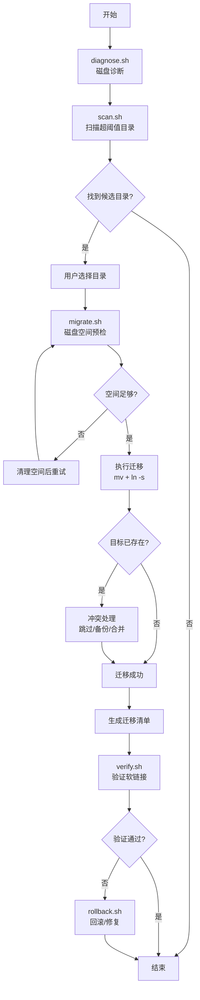

# My Migrate Disk

通用的根目录磁盘空间迁移技能，通过软链接方式解决根分区空间不足的问题。支持用户自定义阈值，仅迁移超过阈值的目录。

## 核心特性

1. **通用方案** - 不限定特定目录，扫描 /root 下所有子目录
2. **阈值驱动** - 用户设置阈值大小，仅处理超过阈值的目录
3. **交互选择** - 显示候选目录列表，用户可选择性迁移
4. **冲突处理** - 同名目录存在时由用户决策处理方式
5. **自动验证** - 迁移后自动验证软链接和命令可用性
6. **回滚支持** - 支持将迁移的目录回滚到原位置

## 设计原则

| 原则 | 说明 |
|------|------|
| 通用性 | 支持任何 /root 下的子目录，不限定特定目录 |
| 最小干预 | 低于阈值的目录不处理，减少风险 |
| 用户控制 | 用户选择要迁移的目录，非全自动 |
| 可逆性 | 软链接方式，便于回滚 |

## 使用流程



### 1. 诊断阶段

```bash
bash /root/.claude/skills/my-migrate-disk/SCRIPTS/diagnose.sh
```

### 2. 扫描阶段

```bash
bash /root/.claude/skills/my-migrate-disk/SCRIPTS/scan.sh 100M
```

参数说明：
- 阈值格式：`100M`、`1G`、`500K`
- 默认阈值：100M
- 跳过已存在的软链接

### 3. 迁移阶段

```bash
bash /root/.claude/skills/my-migrate-disk/SCRIPTS/migrate.sh
```

迁移脚本会自动：
1. 创建 `/data/migrate-root/` 目标目录
2. 移动选中目录到目标位置
3. 创建软链接回 /root
4. 验证软链接有效性

**冲突处理**（同名目录已存在时）：
- 选项 1: 跳过
- 选项 2: 备份后覆盖（重命名原目录）
- 选项 3: 合并目录内容

### 4. 验证阶段

```bash
bash /root/.claude/skills/my-migrate-disk/SCRIPTS/verify.sh
```

### 5. 回滚（如需）

```bash
bash /root/.claude/skills/my-migrate-disk/SCRIPTS/rollback.sh
```

支持：
- 回滚单个目录
- 回滚全部目录
- 修复断裂的软链接

## 目标目录结构

```
/data/
└── migrate-root/              # 统一迁移目标目录
    ├── xxx                    # 迁移的目录
    └── ...
```

## 统一文档项目

迁移清单保存到用户统一文档项目的 `migrated-disk/` 目录：

- 文件名格式：`{主机名}-{IP}-{日期}-migrated.md`
- 示例：`aiubuntus1-192.168.40.201-2026-04-27-migrated.md`
- 统一文档项目路径从 `~/.claude/memory/user_doc_dir.md` 读取

## 脚本说明

| 脚本 | 功能 |
|------|------|
| `common.sh` | 公共模块：颜色、日志、排除列表、磁盘检查等工具函数 |
| `diagnose.sh` | 诊断��盘空间，显示根分区和 /root 目录占用 |
| `scan.sh` | 扫描超过阈值的目录，显示并收集用户选择 |
| `migrate.sh` | 执行迁移，磁盘预检，创建软链接，处理冲突，生成清单 |
| `verify.sh` | 验证迁移结果，检查软链接完整性 |
| `rollback.sh` | 回滚迁移目录，支持选择性回滚和断链修复 |

## 配置文件

### 排除列表 (`config/exclude.conf`)

控制 scan.sh 跳过哪些目录，每行一个目录名，支持 `#` 注释：

```
# 系统配置目录
.config
.ssh
.pki

# 项目目录
sh
```

### 日志文件

所有操作记录写入 `/var/log/migrate-disk.log`，便于事后排查。

## ���意事项

1. **建议阈值** - 设为 50M~200M 较���合适，太小无意义，太大可能遗漏重要目录
2. **保留目录** - 通过 `config/exclude.conf` 配置排除列表
3. **空间预检** - migrate.sh 会自动检查目标分区空间（含 10% 安全余量）
4. **软链接断裂** - rollback.sh 支持删除断链、创建空目录替代、重建软链接三种修复方式
5. **操作日志** - 所有关键操作记录在 `/var/log/migrate-disk.log`

## 故障排除

### 软链接断裂

```bash
# 检查状��
ls -la /root/<link>

# 运行回滚脚本处理断裂链接
bash /root/.claude/skills/my-migrate-disk/SCRIPTS/rollback.sh
# 选择 'b' 处理断裂的软链接（支持删除/替代/重建）
```

### 查看操作日志

```bash
# 查看最近的操作记录
tail -50 /var/log/migrate-disk.log
```

### 冲突处理示例

```
目标目录已存在: /data/migrate-root/xxx
请选择操作：
  1. 跳过此目录
  2. 备份后覆盖（将原目录重命名为 xxx.bak.20260427）
  3. 合并目��（将源目录内容移动到目标目录）
```
