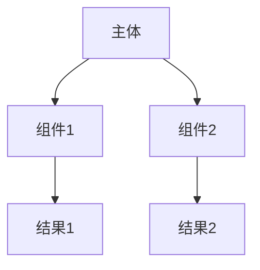
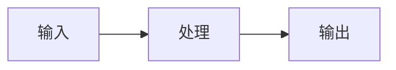
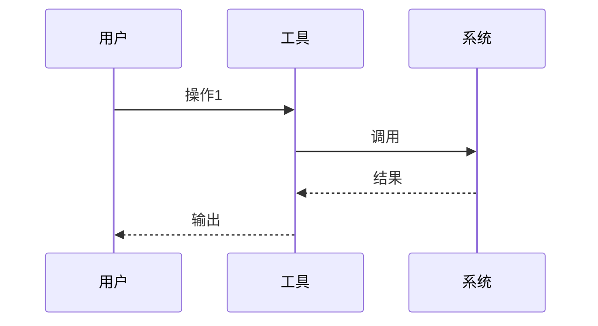

# 研究报告文档结构模板

> 本文件由 SKILL.md Phase 5 引用，定义研究报告的完整 Markdown 结构。

## 章节说明

- 第一章"研究概述"：**必须包含**，简要介绍研究主题和解决的问题
- 第二章"工作原理"：**必须包含**，至少 1 张架构图 + 1 张流程图
- 第五章"命令参考"：**按需生成**，仅当研究主题涉及 CLI 工具/命令时
- 第七章"实战案例"：**必须包含**，至少 1 个从会话中提取的真实案例
- 第十章"难点与挑战"：**必须包含**，记录研究过程中的困难和解决方法

## 模板正文

```markdown
# {研究主题}研究报告

> **研究主题：** {主题名称}
> **日期：** {YYYY-MM-DD}
> **预计耗时：** {X.X} 小时（{HH:MM} ~ {HH:MM}，{空闲说明}）
> **项目路径：** `{abs_path}`
> **GitHub 地址：** {url 或 暂无}
> **本文档链接：** {GitHub 链接（URL 编码版）}

---

## 目录

- [一、研究概述](#一研究概述)
- [二、工作原理](#二工作原理)
- [三、核心概念](#三核心概念)
- [四、应用场景](#四应用场景)
- [五、命令参考](#五命令参考)
- [六、注意事项](#六注意事项)
- [七、实战案例](#七实战案例)
- [八、相关工具对比](#八相关工具对比)
- [九、用户提示词清单](#九用户提示词清单)
- [十、难点与挑战](#十难点与挑战)
- [十一、经验总结](#十一经验总结)

---

## 一、研究概述

（简要介绍研究主题是什么，解决什么问题）

---

## 二、工作原理

### 2.1 架构图



### 2.2 核心流程



---

## 三、核心概念

| 概念 | 说明 |
|------|------|
| 概念1 | 解释1 |
| 概念2 | 解释2 |

---

## 四、应用场景

### 场景矩阵

| 场景 | 适用性 | 用法 |
|------|--------|------|
| 场景1 | ✅ 适合 | 具体用法 |
| 场景2 | ⚠️ 注意 | 注意事项 |

### 典型案例



---

## 五、命令参考

### 核心命令

| 命令 | 说明 | 示例 |
|------|------|------|
| 命令1 | 说明1 | `示例1` |

### 选项速查

| 选项 | 说明 |
|------|------|
| -a | 选项a说明 |

---

## 六、注意事项

| 注意点 | 说明 | 建议 |
|--------|------|------|
| 注意点1 | 说明1 | 建议1 |

---

## 七、实战案例

### 案例：{案例名称}

**问题：** {描述}

**解决：** {方案}

**步骤：**

```bash
# 步骤1
command1
```

**结果：** {结果}

---

## 八、相关工具对比

| 工具 | 优点 | 缺点 | 适用场景 |
|------|------|------|---------|
| 工具A | 优点A | 缺点A | 场景A |

---

## 九、用户提示词清单（原文）

**提示词 1：**
\`\`\`
（原文）
\`\`\`

---

## 十、难点与挑战

| 难点 | 初始判断 | 实际根因 | 解决方法 |
|------|---------|---------|---------|
| 难点1 | 判断1 | 根因1 | 解决1 |

---

## 十一、经验总结

| 经验 | 核心教训 |
|------|---------|
| 经验1 | 教训1 |

---

*文档生成时间：{YYYY-MM-DD} | 由 {模型名称} 辅助生成*
```
